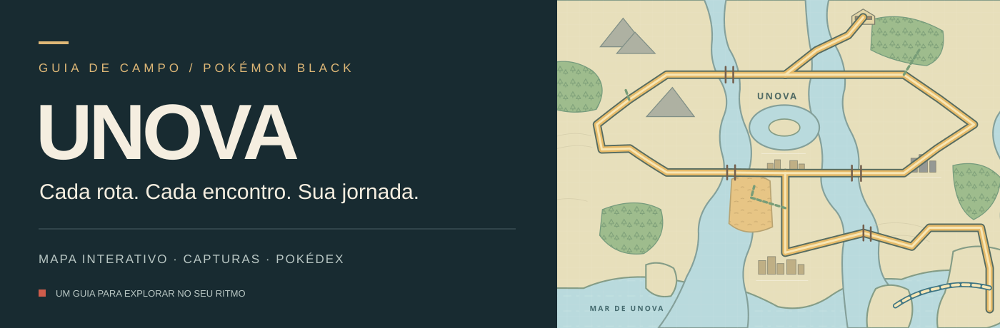

  

  <strong>Seu caderno de viagem por Unova.</strong> 
  Pokémon Black e Black 2 · Complete Unova Pokédex Edition v1.12.

  <a href="#explore-unova">Mapa</a> &nbsp; / &nbsp;
  <a href="#saiba-como-capturar">Encontros</a> &nbsp; / &nbsp;
  <a href="#leve-o-que-precisa">Itens</a> &nbsp; / &nbsp;
  <a href="#uma-lista-para-a-sua-jornada">Pokédex</a> &nbsp; / &nbsp;
  <a href="#o-progresso-é-seu">Sua jornada</a>

---

## Uma nova jornada em Black 2

**[Abrir o caderno de Black 2 →](https://unova-black.vercel.app/black2.html)**

De Aspertia ao pós-jogo, 22 capítulos organizam o caminho em passos que você pode marcar. O guia acompanha a **Complete Unova Pokédex Edition v1.12**, com alternativas às evoluções por troca, encontros adicionados e os itens especiais dessa edição.

| Durante a aventura | No caderno |
| :--- | :--- |
| **“Onde eu parei?”** | Etapa atual, passos concluídos e lembrete pessoal |
| **“Onde encontro esse Pokémon?”** | Área, subárea, método, estação e condições documentadas |
| **“Quero usar essa equipe”** | Seis integrantes, função, item desejado e de zero a quatro golpes planejados |
| **“Quando consigo montar?”** | Primeiro capítulo registrado e métodos de aprendizado, incluindo pré-evoluções |
| **“E a Liga?”** | Dicas de preparo, encontros especiais e consulta das mudanças da hack |

Cinco abas, controles grandes e uma leitura confortável no celular. O progresso de cada jogo fica separado e é salvo automaticamente no aparelho, sem conta. Uma cópia manual fica disponível para quem quiser transferir seus registros.

**Dados sem confirmação aparecem como tal.** A documentação detalhada disponível é v1.11, complementada pelas regras v1.12. Times exatos alterados pela hack e todos os itens comuns ainda não estão integralmente documentados. [Veja a cobertura e as fontes](docs/black2-audit.md).

---

## Pokémon Black · o primeiro caderno

[Continuar a jornada original →](https://unova-black.vercel.app/index.html?game=black)

## Explore Unova

De Nuvema aos caminhos que se abrem depois da Liga, o mapa reúne cidades, rotas e locais especiais em uma visão navegável. Toque em um ponto para abrir a ficha da área; arraste, aproxime ou volte à visão completa para se localizar.

A busca aceita **nomes de Pokémon, itens, lugares, números da Pokédex e códigos de TMs/HMs**. Os filtros ajudam a encontrar áreas da história, do pós-Liga, lendários e capturas compatíveis com o avanço informado na sua jornada.

## Saiba como capturar

Encontrar a rota é só o começo. Cada ficha apresenta os encontros por método, para você saber **onde procurar e o que precisa ter feito antes**.

| O que consultar | O que aparece no guia |
| :--- | :--- |
| **Lugar certo** | Áreas e setores associados aos encontros |
| **Método** | Grama, cavernas, Surf, pesca e outros tipos de encontro |
| **Encontros especiais** | Grama tremendo, poeira, sombras de pontes, água ondulante e enxames |
| **Chance e nível** | Porcentagens do método indicado e faixas de nível das tabelas |
| **Condições** | Estações, movimentos, avanço da história e requisitos específicos |
| **Outras aquisições** | Presentes, fósseis, evoluções, trocas e eventos identificados separadamente |

As fichas diferenciam encontros selvagens das outras formas de obter uma espécie. Exclusivos de White e eventos antigos também recebem contexto: aparecer na Pokédex não significa estar disponível para capturar em uma partida comum de Black.

## Leve o que precisa

Cada local também tem uma seção de **itens, TMs e HMs**. Ela fica recolhida enquanto você consulta os encontros: abra quando quiser conferir o que levar da área, filtre pelas máquinas ou pelos outros itens e marque o que já conseguiu.

As fichas distinguem **itens no chão, escondidos, presentes, compras, trocas por BP e itens que podem sair de poeira ou sombras**. Quando a obtenção depende da estação, de um personagem ou de um trecho da história, a orientação aparece junto do item.

Procure `TM61`, `Fly` ou `Fire Stone` na busca para encontrar os locais correspondentes. As seis HMs e as 94 TMs disponíveis em uma partida normal estão no guia; a TM95 recebe a indicação de indisponível, porque a Lock Capsule nunca foi distribuída oficialmente em Black/White.

## Uma lista para a sua jornada

A **Pokédex original de Unova, de #000 a #155**, pode ser consultada pela numeração do jogo ou pela ordem da jornada. Há também uma lista das espécies antigas presentes no guia, com sua numeração Nacional.

Marque as espécies registradas, acompanhe a contagem e procure o próximo objetivo sem perder de vista como ele é obtido.

## O progresso é seu

Sua jornada guarda Pokémon e itens marcados, insígnias, inicial, fóssil, estação e condições como acesso a Surf ou conclusão da Liga. Essas escolhas ajudam o guia a mostrar as capturas disponíveis no seu momento do jogo.

**Cada pessoa salva o próprio progresso no seu celular ou navegador.** Os registros ficam no aparelho, sem conta ou cadastro. Você pode fechar a página e voltar depois; para levar a jornada a outro dispositivo ou guardar uma cópia, use **Exportar progresso** e **Importar arquivo**.

O site se adapta ao computador e ao celular. Adicionar um atalho à tela inicial deixa o guia por perto durante a partida; o progresso continua local e não é sincronizado automaticamente entre aparelhos.

---

### Fontes e créditos

Os encontros usam como referência o [Pokéarth, da Serebii](https://www.serebii.net/pokearth/unova/), com links nas fichas para consultar as tabelas de Black. As porcentagens se referem ao método de encontro indicado.

Os itens usam as tabelas de Black do Pokéarth e os guias de [TMs/HMs](https://www.smogon.com/ingame/guides/bw-tms) e [itens de Black/White](https://www.smogon.com/ingame/guides/bw_items) da Smogon. Cada ficha de item tem seu próprio link de referência.

O mapa vetorial e a arte deste README utilizam um traçado inspirado no [mapa de Unova de PatoAnidae02](https://commons.wikimedia.org/wiki/File:UnovaMap.png), sob [CC BY-SA 4.0](https://creativecommons.org/licenses/by-sa/4.0/).

Este é um projeto de fã. Pokémon e os nomes relacionados pertencem aos seus respectivos titulares.

### Um roteiro para acompanhar a viagem

A história tem um roteiro dividido em etapas, com os lugares na ordem da jornada e visitas extras separadas. Cada parada abre sua ficha no mapa. As fichas situam o local na aventura e explicam como procurar Pokémon, pegar itens e reconhecer o que ainda depende de progresso.

### Ferramentas para continuar a aventura

Além de consultar o mapa, você pode acompanhar o próximo objetivo, marcar tarefas e descobrir onde vale voltar com Surf, Strength ou a vara de pesca. Uma equipe de até seis Pokémon reúne as rotas de obtenção e as evoluções; buscas de itens e golpes ajudam a preparar cada visita.

As ferramentas também explicam por que um encontro pode não acontecer, mostram serviços úteis, organizam a agenda do jogo e separam as pendências da Pokédex por método de obtenção. Um modo opcional esconde etapas futuras. Cada local tem espaço para seu próprio lembrete.

Depois da primeira abertura com conexão, os arquivos do guia ficam disponíveis para consulta sem internet. Capturas, itens, equipe, tarefas e notas pertencem ao aparelho de cada jogador. A sincronização por conta foi preparada e ainda aguarda ativação; o salvamento local continua independente dela.

## Um time pensado desde o início

A aba **Equipe** reúne seu time ideal e os integrantes que você está usando agora. Planeje apenas os golpes que quiser, escolha um item e descreva a função de cada Pokémon. A linha do tempo mostra onde começar, o caminho de evolução e os recursos que faltam, com atenção às condições de Pokémon Black.

Em **Jogar**, o guia fica à mão: tarefas da etapa, local onde você parou e seu lembrete pessoal. A seção **Batalhas** traz a primeira Liga, confrontos importantes com N e Ghetsis e cuidados próprios para capturar lendários. Os detalhes ficam recolhidos até você abrir.

No celular, a navegação inferior mantém mapa, Pokédex, equipe, modo de jogo e ferramentas separados. Seu progresso continua salvo automaticamente no próprio aparelho, sem exigir conta.
